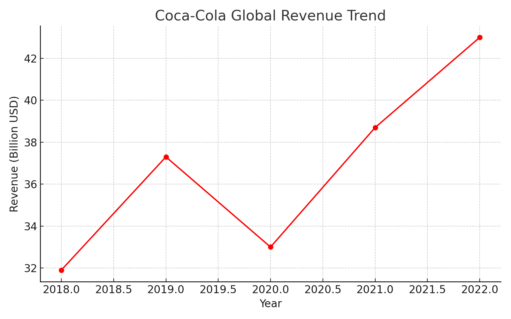
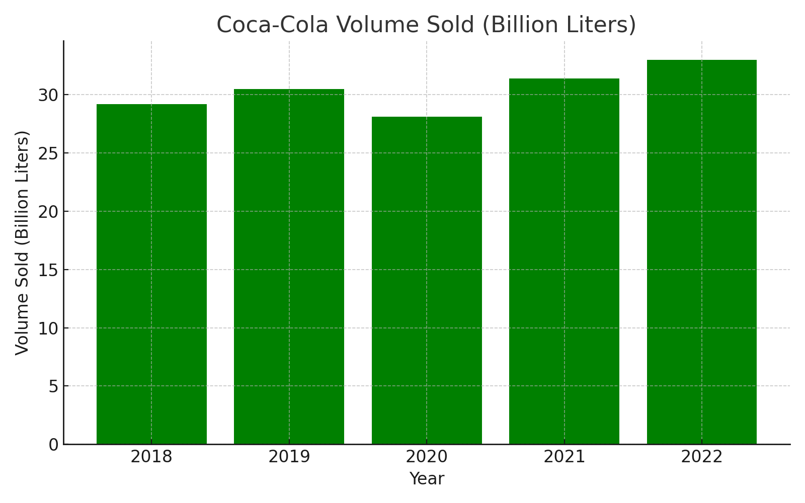

# 🥤 Coca-Cola Sales Analysis (2018–2022)

This project analyzes **Coca-Cola’s global sales data** for 5 years using Python.

## 📊 Features
✅ Displays sales data in a table  
✅ Calculates **total revenue, average volume, and growth rate**  
✅ Generates 2 graphs:
- Coca-Cola Revenue Trend (2018–2022)
- Volume Sold Comparison per Year  

## 📦 Requirements
- Python 3.x
- NumPy
- Pandas
- Matplotlib

Install dependencies:
```bash
pip install -r requirements.txt
```

## ▶️ How to Run
```bash
python coca_cola_analysis.py
```

## 📈 Example Output

**Data Table**
```
   Year  Sales_Revenue_Billion_USD  Volume_Sold_Billion_Liters  Avg_Bottle_Price_USD
0  2018                      31.9                        29.2                  1.20
1  2019                      37.3                        30.5                  1.25
2  2020                      33.0                        28.1                  1.30
3  2021                      38.7                        31.4                  1.35
4  2022                      43.0                        33.0                  1.40
```

**Graphs:**



---

📌 **Author:** Your Name  
📌 **License:** MIT
